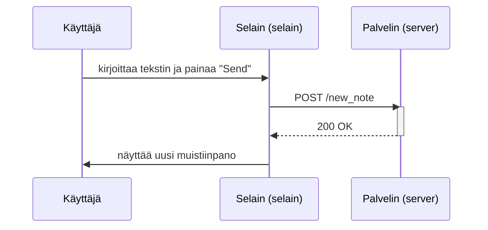
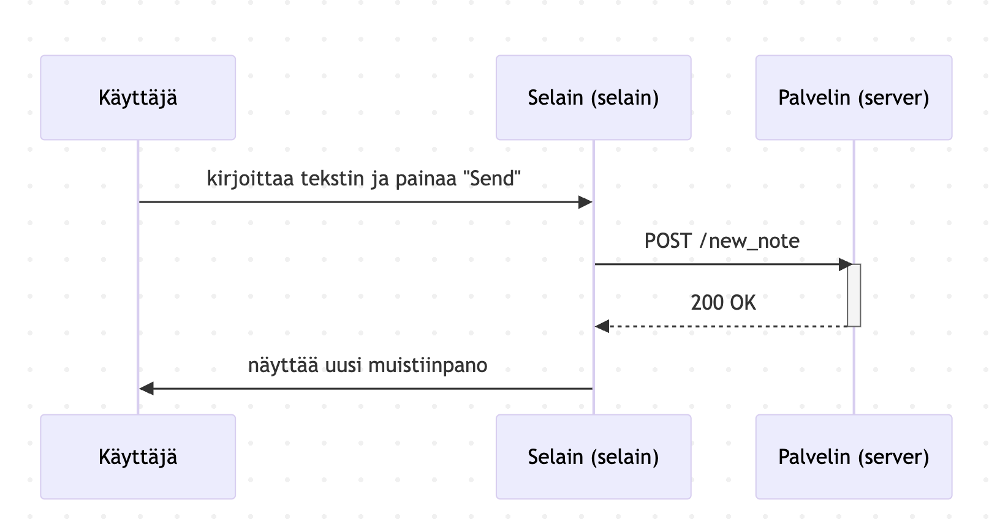

# Uuden muistiinpanon luominen

```mermaid
sequenceDiagram
    participant Käyttäjä
    participant Selain as Selain (selain)
    participant Palvelin as Palvelin (server)

    Käyttäjä->>Selain: kirjoittaa tekstin ja painaa "Send"

    Selain->>Palvelin: POST /new_note
    activate Palvelin
    %% Palvelin lisää tiedot muistiinpanoihin
    Palvelin-->>Selain: 200 OK
    deactivate Palvelin

    Selain->>Käyttäjä: näyttää uusi muistiinpano
```

