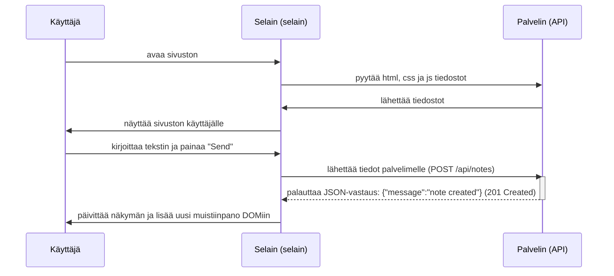

# Uuden muistiinpanon luominen (SPA)

```mermaid
sequenceDiagram
    participant Käyttäjä
    participant Selain as Selain (selain)
    participant Palvelin as Palvelin (API)

    Käyttäjä->>Selain: avaa sivuston

    Selain->>Palvelin: pyytää html, css ja js tiedostot
    Palvelin->>Selain: lähettää tiedostot
    Selain->>Käyttäjä: näyttää sivuston käyttäjälle

    Käyttäjä->>Selain: kirjoittaa tekstin ja painaa "Send"

    Selain->>Palvelin: lähettää tiedot palvelimelle (POST /api/notes)
    activate Palvelin
    %% Palvelin lisää tiedot muistiinpanoihin
    Palvelin-->>Selain: palauttaa JSON-vastaus: {"message":"note created"} (201 Created)
    deactivate Palvelin

    Selain->>Käyttäjä: päivittää näkymän ja lisää uusi muistiinpano DOMiin
```